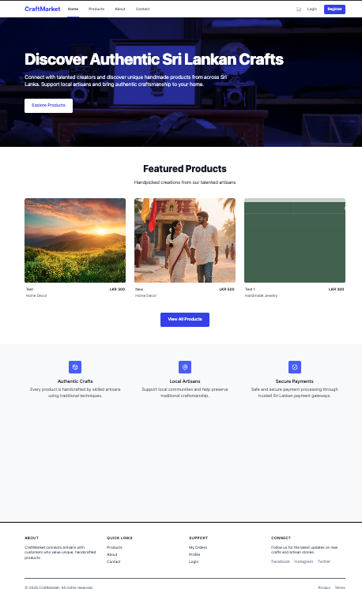
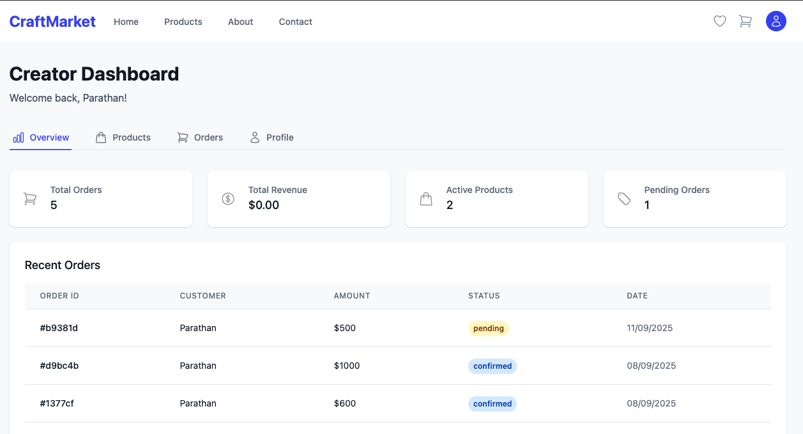
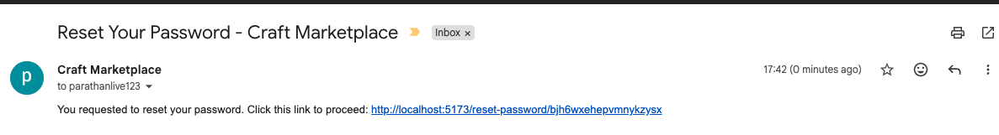

# CraftMarket - Sri Lankan Crafts E-Commerce Platform

A full-stack e-commerce platform connecting talented Sri Lankan artisans with customers who value unique, handcrafted products. Creators can list and manage their handmade products, while customers can browse, purchase, and review items.



## Features

### Customer Features
- **Browse & Search** - Filter products by category, price range, and keywords with pagination
- **Product Details** - Image gallery with thumbnails, detailed descriptions, and customer reviews
- **Shopping Cart** - Persistent cart with quantity stepper (+/-), real-time total calculation
- **Wishlist** - Save favorite products with heart icon toggle on cards and product pages
- **Checkout** - Shipping form with inline validation, PayHere payment gateway integration
- **Order Tracking** - View order history with status updates (pending, confirmed, shipped, delivered)
- **Reviews** - Star ratings and comments (only for purchased products)
- **Authentication** - Email verification, password reset, JWT-based sessions

### Creator Features
- **Creator Dashboard** - Overview stats (orders, revenue, products), order management
- **Product Management** - Add/edit/delete products with multi-image upload (up to 5 images, 5MB each)
- **Order Fulfillment** - View and manage orders for your products



### Admin Features
- **Admin Dashboard** - Platform-wide statistics and recent activity
- **User Management** - View, search, activate/deactivate, and delete users
- **Product Management** - Monitor and toggle product status across the platform
- **Order Management** - View all orders, update statuses via dropdown
- **Category Management** - Create, edit, and delete product categories
- **Contact Messages** - View and manage contact form submissions with read/unread tracking

### Other Features
- **Email Notifications** - Verification emails, password reset, contact form forwarding
- **Contact Form** - Stored in database and emailed to admin
- **Responsive Design** - Mobile-first with Tailwind CSS, smooth transitions, hover effects
- **Security** - Helmet, rate limiting, CORS, bcrypt password hashing, JWT authentication



## Tech Stack

### Frontend
| Technology | Purpose |
|-----------|---------|
| React 19 | UI framework |
| Vite 7 | Build tool & dev server |
| Tailwind CSS 4 | Styling |
| React Router 7 | Client-side routing |
| Axios | HTTP requests |
| Headless UI | Accessible UI components |
| Heroicons | Icon set |
| React Hot Toast | Notifications |

### Backend
| Technology | Purpose |
|-----------|---------|
| Node.js | Runtime |
| Express.js 4 | Web framework |
| MongoDB + Mongoose 8 | Database & ODM |
| JWT | Authentication |
| Bcrypt | Password hashing |
| Nodemailer | Email service |
| Multer | File uploads |
| Helmet | Security headers |
| PayHere SDK | Payment gateway (Sri Lankan) |

## Project Structure

```
craftmarket/
├── craft-app-backend/          # Express.js API server
│   ├── models/                 # Mongoose schemas
│   │   ├── User.js
│   │   ├── Product.js
│   │   ├── Order.js
│   │   ├── Payment.js
│   │   ├── Category.js
│   │   ├── Review.js
│   │   ├── Contact.js
│   │   └── Token.js
│   ├── routes/                 # API route handlers
│   │   ├── auth.js             # Auth + favorites
│   │   ├── products.js
│   │   ├── orders.js
│   │   ├── payments.js         # PayHere integration
│   │   ├── admin.js
│   │   ├── reviews.js
│   │   └── contact.js
│   ├── middleware/
│   │   ├── auth.js             # JWT + role-based auth
│   │   └── upload.js           # Multer config
│   ├── utils/
│   │   ├── sendEmail.js
│   │   └── jwt.js
│   ├── uploads/                # Product images
│   └── index.js                # Server entry point
│
├── craft-app-frontend/         # React SPA
│   └── src/
│       ├── components/
│       │   ├── Auth/           # Login, Register, Route guards
│       │   ├── Layout/         # Navbar, Footer
│       │   └── UI/             # StatusBadge, Modal
│       ├── context/            # React Context providers
│       │   ├── AuthContext.jsx
│       │   ├── ProductContext.jsx
│       │   └── CartContext.jsx
│       ├── pages/              # 17 page components
│       │   ├── Home.jsx
│       │   ├── Products.jsx
│       │   ├── ProductDetail.jsx
│       │   ├── Cart.jsx
│       │   ├── Checkout.jsx
│       │   ├── Wishlist.jsx
│       │   ├── Orders.jsx
│       │   ├── Profile.jsx
│       │   ├── CreatorDashboard.jsx
│       │   ├── AdminDashboard.jsx
│       │   ├── Contact.jsx
│       │   ├── About.jsx
│       │   └── ...
│       ├── App.jsx
│       └── index.css
│
└── screenshots/                # App screenshots
```

## Getting Started

### Prerequisites
- Node.js 20.19+ or 22.12+
- MongoDB (local or Atlas)
- Gmail account (for email service)
- PayHere merchant account (for payments, optional)

### 1. Clone the repository
```bash
git clone https://github.com/your-username/craftmarket.git
cd craftmarket
```

### 2. Backend Setup
```bash
cd craft-app-backend
npm install

# Create environment file
cp .env.example .env
# Edit .env with your credentials (see Environment Variables below)

# Start the server
npm run dev
```
The API server starts at `http://localhost:4000`.

### 3. Frontend Setup
```bash
cd craft-app-frontend
npm install

# Create environment file
cp .env.example .env
# Edit .env if needed

# Start the dev server
npm run dev
```
The app opens at `http://localhost:5173`.

## Environment Variables

### Backend (`craft-app-backend/.env`)
| Variable | Description | Required |
|----------|-------------|----------|
| `EMAIL_USER` | Gmail address for sending emails | Yes |
| `EMAIL_PASS` | Gmail app password ([generate here](https://myaccount.google.com/apppasswords)) | Yes |
| `JWT_SECRET` | Secret key for JWT token signing | Yes |
| `JWT_EXPIRES_IN` | Token expiry duration (e.g., `1h`, `7d`) | Yes |
| `FRONTEND_URL` | Frontend URL for email links | Yes |
| `MONGODB_URI` | MongoDB connection string | No (defaults to localhost) |
| `PAYHERE_MERCHANT_ID` | PayHere merchant ID | For payments |
| `PAYHERE_SECRET_KEY` | PayHere secret key | For payments |

### Frontend (`craft-app-frontend/.env`)
| Variable | Description | Required |
|----------|-------------|----------|
| `VITE_API_URL` | Backend API URL | Yes |
| `VITE_PAYHERE_MERCHANT_ID` | PayHere merchant ID | For payments |
| `VITE_PAYHERE_ENV` | `sandbox` or `production` | For payments |

## API Endpoints

### Authentication
| Method | Endpoint | Description |
|--------|----------|-------------|
| POST | `/api/auth/register` | Register new user |
| POST | `/api/auth/login` | Login |
| GET | `/api/auth/verify-email/:token` | Verify email |
| GET | `/api/auth/me` | Get current user |
| PUT | `/api/auth/profile` | Update profile |
| PUT | `/api/auth/change-password` | Change password |
| POST | `/api/auth/forgot-password` | Request password reset |
| POST | `/api/auth/reset-password` | Reset password |
| GET | `/api/auth/favorites` | Get wishlist |
| POST | `/api/auth/favorites/:productId` | Add to wishlist |
| DELETE | `/api/auth/favorites/:productId` | Remove from wishlist |

### Products
| Method | Endpoint | Description |
|--------|----------|-------------|
| GET | `/api/products` | List products (public, with filters) |
| GET | `/api/products/:id` | Get product details |
| POST | `/api/products` | Create product (creator) |
| PUT | `/api/products/:id` | Update product (creator) |
| DELETE | `/api/products/:id` | Delete product (creator) |

### Orders
| Method | Endpoint | Description |
|--------|----------|-------------|
| POST | `/api/orders` | Create order |
| GET | `/api/orders/my-orders` | Get user's orders |
| GET | `/api/orders/:id` | Get order details |
| PATCH | `/api/orders/:id/cancel` | Cancel order |

### Reviews
| Method | Endpoint | Description |
|--------|----------|-------------|
| GET | `/api/reviews/product/:productId` | Get product reviews |
| POST | `/api/reviews` | Create review (must have purchased) |
| DELETE | `/api/reviews/:id` | Delete review |

### Contact
| Method | Endpoint | Description |
|--------|----------|-------------|
| POST | `/api/contact` | Submit contact form |

## User Roles

| Role | Capabilities |
|------|-------------|
| **Customer** (`user`) | Browse, purchase, review, wishlist |
| **Creator** (`creator`) | All customer features + product management, order fulfillment |
| **Admin** (`admin`) | Full platform management, user/product/order/category CRUD |

## License

MIT
